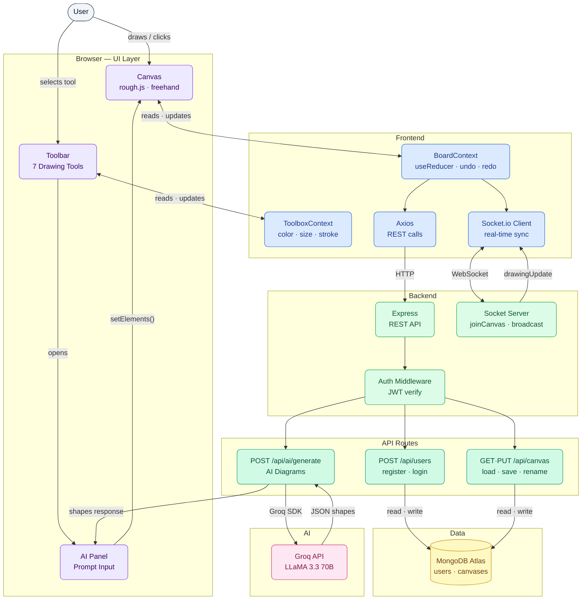
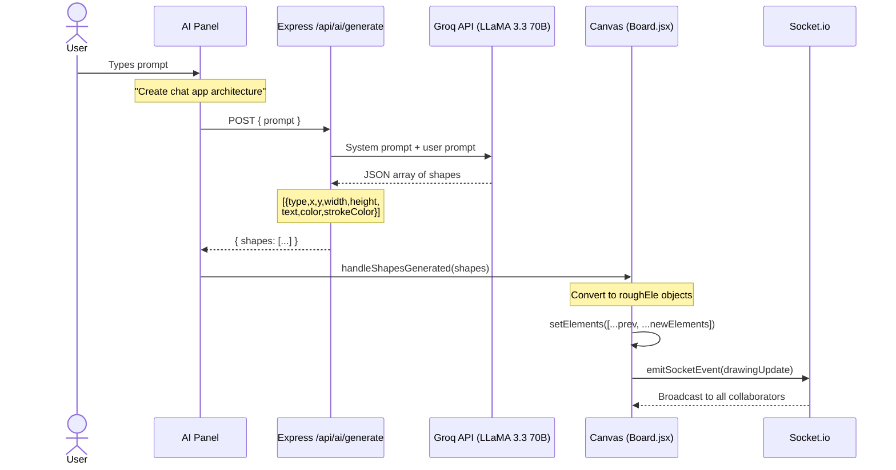

<div align="center">

# SyncSpace

### AI-Powered Collaborative Whiteboard 

[](https://react.dev)
[](https://nodejs.org)
[](https://socket.io)
[](https://mongodb.com)
[](https://groq.com)

[Features](#-features) • [Architecture](#-project-architecture) • [Getting Started](#-getting-started)

</div>

---

##  Overview

SyncSpace is a full-stack real-time collaborative whiteboard application. Multiple users can draw simultaneously on shared canvases, and an integrated AI assistant can help generate system architecture diagrams, flowcharts, and component diagrams directly on the canvas from a simple text prompt.

---

## Features

###  Real-time Collaboration
- Multiple users can draw on the same canvas simultaneously
- Changes sync instantly via Socket.io
- Join any canvas by shared URL
- Authorization-only permitted users can edit

### Generative AI Diagram Builder
- Transform natural language prompts into fully structured, color-coded system architecture diagrams in seconds (e.g. “Design a scalable URL shortener architecture”)
- Real-time synchronization ensures every generated update appears instantly for all collaborators
- by **Groq API** (LLaMA 3.3 70B)

### Canvas Management
- Create, rename, and save multiple canvases
- Auto-save on every drawing action
- Load previous canvases from the dashboard
- Download canvas as PNG

---

## Project Folder Structure

```
collabboard/
├── frontend/  
│   └── src/
│       ├── components/
│       │   ├── Board/                 # Main canvas component
│       │   │   ├── index.jsx          # Canvas rendering, mouse handlers, AI integration
│       │   │   └── index.module.css
│       │   ├── Toolbar/               # Top toolbar with drawing tools
│       │   │   ├── index.jsx
│       │   │   └── index.module.css
│       │   ├── Toolbox/               # Color & size pickers sidebar
│       │   │   ├── index.jsx
│       │   │   └── index.module.css
│       │   ├── Sidebar/               # Navigation sidebar
│       │   ├── AIPromptPanel/         # AI diagram generator UI
│       │   │   ├── index.jsx
│       │   │   └── index.module.css
│       │   ├── Dashboard/             # Canvas list & management
│       │   ├── LandingPage/           # Marketing landing page
│       │   ├── About/                 # About page
│       │   ├── Help/                  # Help & FAQ page
│       │   ├── Login/                 # Auth pages
│       │   └── Register/
│       ├── store/
│       │   ├── board-context.js       # Context shape & defaults
│       │   ├── BoardProvider.jsx      # Canvas state (useReducer) + AI panel state
│       │   └── toolbox-context.js     # Stroke/fill/size state
│       ├── utils/
│       │   ├── element.js             # Element creation & hit-testing
│       │   ├── socket.js              # Socket.io client helpers
│       │   └── api.js                 # Axios API helpers
│       ├── constants.js               # TOOL_ITEMS, BOARD_ACTIONS, TOOL_ACTION_TYPES
│       └── App.jsx                    # Routes
│
└── backend/                         
    ├── server.js                   
    ├── config/
    │   └── db.js                        # DB connection
    ├── controllers/
    │   ├── canvasController.js          # Canvas CRUD logic
    │   └── userController.js            # Register, login logic
    ├── middlewares/
    │   └── authMiddleware.js            # JWT verification
    ├── models/
    │   ├── canvasModel.js               # Canvas Mongoose schema
    │   └── userModel.js                 # User Mongoose schema
    ├── routes/
    │   ├── aiRoutes.js                  # POST: /api/ai/generate
    │   ├── canvasRoutes.js              # Canvas REST endpoints
    │   └── userRoutes.js                # Auth endpoints
    ├── services/
    │   └── userService.js        
    ├── sockets/
    │   └── socketHandler.js             # joinCanvas,drawingUpdate
    └── utils/
        └── jwt.js                       # Token sign & verify 
```

## Architecture


 
##  AI Work Flow
 

 
---

## Getting Started

### Prerequisites
- Node.js 18+
- MongoDB (local or Atlas)
- [Groq API key](https://console.groq.com/keys) 

### 1. Clone the repo

```bash
git clone https://github.com/priyanshu026922/SyncSpace.git
cd SyncSpace
```

### 2. Backend setup

```bash
cd backend
npm install
```

Create `.env`:

```env
PORT=5000
MONGODB_URI=__your_mongodb_database_url_here__
JWT_SECRET=jwt_secret_here
GROQ_API_KEY=_gsk_groq_api_key_
```

Start the server:

```bash
node server.js
```

### 3. Frontend setup

```bash
cd frontend
npm install
```

Create `.env`:

```env
VITE_API_BASE_URL=http://localhost:5000/api
VITE_SOCKET_URL=http://localhost:5000
```

Start the dev server:

```bash
npm run dev
```

### 4. Open the app

```
http://localhost:3000
```

---


### AI Integration
| Method | Endpoint | Body | Description |
|--------|----------|------|-------------|
| `POST` | `/api/ai/generate` | `{ "prompt": "..." }` | Generate diagram JSON from prompt |

**Example request:**
```bash  
  (IN POSTMAN)
  POST  http://localhost:5000/api/ai/generate
    Body → raw → JSON

    {
    "prompt": "System design for URL shortener"
    }
```

**Example response:**
```json
{
  "shapes": [
    { "type": "rectangle", "x": 60, "y": 100, "width": 180, "height": 60, "text": "Client", "color": "#dbeafe", "strokeColor": "#2563eb" },
    { "type": "rectangle", "x": 320, "y": 100, "width": 180, "height": 60, "text": "API Gateway", "color": "#ffedd5", "strokeColor": "#ea580c" },
    { "type": "arrow", "x1": 240, "y1": 130, "x2": 320, "y2": 130, "strokeColor": "#94a3b8" }
  ]
}
```
---


## Tech Stack

| Layer | Technologies |
|-------|-------------|
| Frontend | React.js, Rough.js,Socket.io Client,Axios,React Router|
| Backend | Node.js, Express, Socket.io, MongoDB, Mongoose, JWT ,dotenv|
| AI | Groq SDK · LLaMA 3.3 70B |
